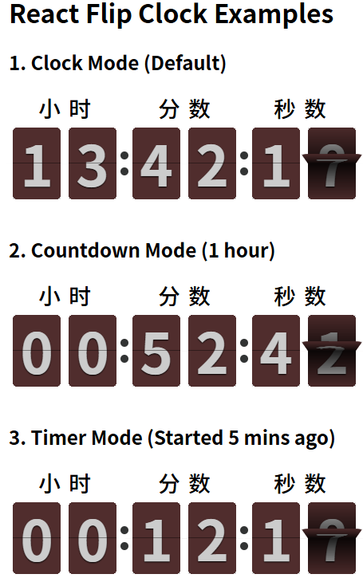

# react 翻页时钟计时器

> 基于 React 开发的一个翻页动画效果非常漂亮的计时器，支持时钟、倒计时和计时器模式。
预览地址：http://xiaxiangfeng.github.io/flip-clock/index.html



## 从NPM下载包

``` npm
npm i react-flip-clock
```

## 使用实例

### 引入包

``` js
import Clock from 'react-flip-clock'
```

### 1. 时钟模式 (默认)

``` js
<Clock />
```

### 2. 倒计时模式

``` js
// 目标时间：1小时后
const targetTime = new Date().getTime() + 60 * 60 * 1000

<Clock mode="countdown" value={targetTime} />
```

### 3. 计时器模式

``` js
// 开始时间：5分钟前
const startTime = new Date().getTime() - 5 * 60 * 1000

<Clock mode="timer" value={startTime} />
```

## Props

| 属性 | 类型 | 默认值 | 描述 |
| --- | --- | --- | --- |
| `mode` | String | `'clock'` | 模式，可选值: `'clock'` (时钟), `'countdown'` (倒计时), `'timer'` (计时器) |
| `value` | Date \| Number | `new Date()` | `'countdown'` 模式下为目标时间，`'timer'` 模式下为开始时间。支持 Date 对象或时间戳。 |

### 自定义样式

#### 编写样式覆盖即可

``` css
/*宽高*/
.flip-clock-wrapper ul {
  width: 60px;
  height: 90px;
}

/*背景颜色、字体大小*/
.flip-clock-wrapper .inn {
  background-color: #502d2d;
  font-size: 70px;
}
```

## Build Setup

``` bash
# install dependencies
npm install

# serve with hot reload at localhost:8080
npm run dev

# build for production with minification
npm run build

# build for production and view the bundle analyzer report
npm run build --report

# run unit tests
npm run unit

# run all tests
npm test
```
